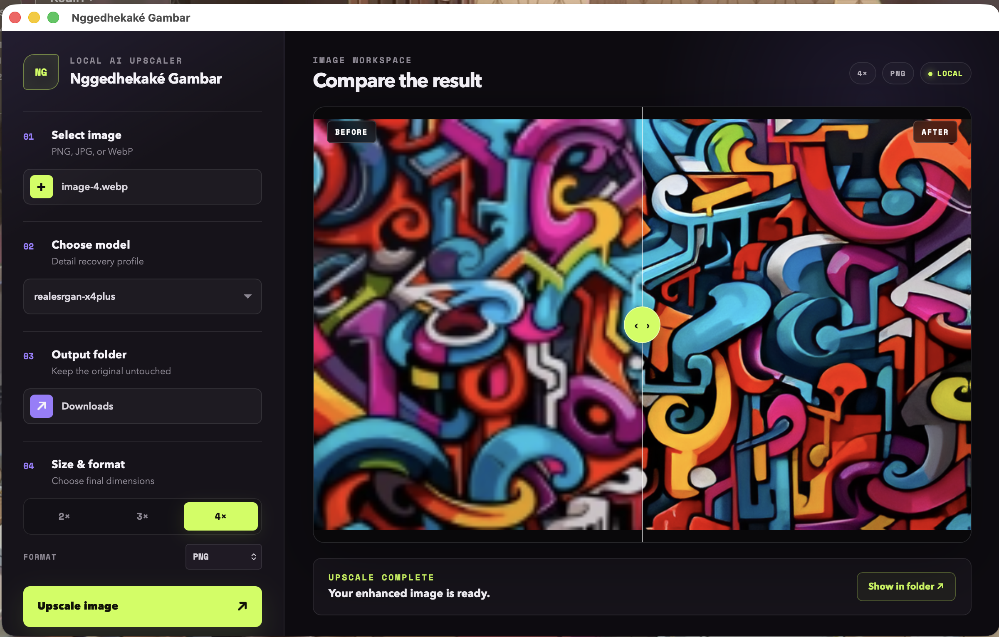
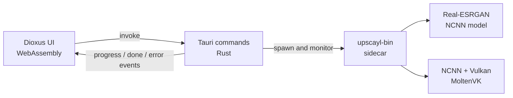

<div align="center">

# Nggedhekaké Gambar

**A private, native image upscaler powered by Real-ESRGAN, NCNN, and Vulkan.**

Enhance PNG, JPEG, and WebP images locally—without uploading them to a server.

[](./LICENSE)
[](https://www.rust-lang.org/)
[](https://v2.tauri.app/)
[](https://dioxuslabs.com/)
[](#platform-support)

</div>



## Overview

Nggedhekaké Gambar is a Rust-native desktop application for single-image upscaling. A Dioxus interface runs inside Tauri while an `upscayl-ncnn` sidecar performs inference on the local GPU through NCNN and Vulkan/MoltenVK.

The current build focuses on a small, dependable workflow: select an image, choose the output settings, run the model, and compare the result with an interactive before/after slider.

## Features

- Fully local processing—selected images never leave the machine.
- Native file and folder pickers.
- PNG, JPEG, and WebP input and output.
- 2×, 3×, and 4× output scaling.
- Bundled `realesrgan-x4plus` NCNN model.
- GPU-accelerated inference through Vulkan/MoltenVK.
- Live progress reporting with cancellation support.
- Centered, aspect-ratio-safe image previews.
- Interactive before/after comparison slider.
- Direct access to the generated output folder.

## Technology

| Layer | Technology |
| --- | --- |
| Desktop shell | [Tauri 2](https://v2.tauri.app/) |
| User interface | [Dioxus 0.7](https://dioxuslabs.com/) compiled to WebAssembly |
| Application language | [Rust](https://www.rust-lang.org/) |
| Inference sidecar | [upscayl-ncnn](https://github.com/upscayl/upscayl-ncnn) |
| Neural network runtime | [Tencent NCNN](https://github.com/Tencent/ncnn) |
| GPU backend | Vulkan through MoltenVK on macOS |
| Bundled model | Real-ESRGAN `realesrgan-x4plus` |

## Architecture



The frontend does not read or transform image data itself. It sends filesystem paths and settings to Tauri commands. The backend validates those values, starts the bundled sidecar, parses progress from `stderr`, and emits typed events back to the UI.

## Platform support

The repository currently bundles a universal macOS sidecar containing both `arm64` and `x86_64` architectures.

| Platform | Status |
| --- | --- |
| macOS Apple Silicon | Supported and tested |
| macOS Intel | Bundled; community testing welcome |
| Windows | Not bundled yet |
| Linux | Not bundled yet |

Tauri and Dioxus are cross-platform, but Windows and Linux support requires adding the corresponding `upscayl-bin` sidecar and validating resource paths and packaging.

## Prerequisites

- macOS
- [Rust toolchain](https://rustup.rs/)
- WebAssembly target
- [Dioxus CLI 0.7](https://dioxuslabs.com/learn/0.7/getting_started/)
- [Tauri CLI 2](https://v2.tauri.app/reference/cli/)
- Xcode Command Line Tools

Install the required Rust target and CLIs:

```sh
rustup target add wasm32-unknown-unknown
cargo install tauri-cli --version "^2.0.0" --locked
cargo install dioxus-cli --version "^0.7" --locked
```

If you use `cargo-binstall`, the Dioxus CLI can be installed faster with:

```sh
cargo binstall dioxus-cli@0.7.2 --force
```

## Development

Clone the repository and start the Tauri development application:

```sh
git clone https://github.com/bangadam/nggedhekake-gambar.git
cd nggedhekake-gambar
cargo tauri dev
```

The Tauri development command starts the Dioxus web server on port `1420`, compiles the Rust backend, and launches the native application window.

Useful checks:

```sh
# Tauri backend
cargo check -p nggedhekake-gambar

# Dioxus frontend
cargo check -p nggedhekake-gambar-ui --target wasm32-unknown-unknown

# Format all Rust sources
cargo fmt --all
```

## Production build

Build the frontend and native application bundle:

```sh
cargo tauri build
```

Generated artifacts are written beneath `target/release/bundle/`. The build includes the sidecar and NCNN model files configured in `src-tauri/tauri.conf.json`.

## Project structure

```text
.
├── app-preview.png              # README application preview
├── assets/
│   └── styles.css               # Application theme and responsive layout
├── src/
│   ├── app.rs                   # Root UI, model loading, and Tauri events
│   ├── state.rs                 # Shared Dioxus application state
│   └── components/
│       ├── sidebar.rs           # Four-step upscale workflow
│       ├── main_content.rs      # Preview, progress, and result states
│       └── image_slider.rs      # Before/after comparison control
└── src-tauri/
    ├── binaries/
    │   └── upscayl-bin          # Universal macOS inference sidecar
    ├── models/
    │   ├── realesrgan-x4plus.bin
    │   └── realesrgan-x4plus.param
    ├── capabilities/            # Tauri permission declarations
    └── src/lib.rs               # Dialog, process, model, and folder commands
```

## Model and engine provenance

The bundled components are reproducible from these upstream sources:

- Engine repository: [`upscayl/upscayl-ncnn`](https://github.com/upscayl/upscayl-ncnn)
- Engine release: [`20251207-174704`](https://github.com/upscayl/upscayl-ncnn/releases/tag/20251207-174704)
- macOS archive: `upscayl-bin-20251207-174704-macos.zip`
- Model architecture: [`xinntao/Real-ESRGAN`](https://github.com/xinntao/Real-ESRGAN)
- Exact NCNN model revision: [`upscayl/upscayl@773ca39`](https://github.com/upscayl/upscayl/commit/773ca39daafbac3f0fea75885195cb68a8a3ea27)
- [`realesrgan-x4plus.bin`](https://github.com/upscayl/upscayl/blob/773ca39daafbac3f0fea75885195cb68a8a3ea27/resources/models/realesrgan-x4plus.bin)
- [`realesrgan-x4plus.param`](https://github.com/upscayl/upscayl/blob/773ca39daafbac3f0fea75885195cb68a8a3ea27/resources/models/realesrgan-x4plus.param)

`get_models` only exposes a model when both its `.param` and `.bin` files are present in the bundled model directory.

## Privacy and security

- Images are processed from local filesystem paths.
- No image or inference data is uploaded by the application.
- The output is written only to the folder selected by the user.
- Tauri capabilities are declared in `src-tauri/capabilities/default.json`.
- Local image previews use Tauri's scoped asset protocol.

Please report security-sensitive issues privately to the repository owner instead of opening a public issue.

## Contributing

Contributions are welcome. Before opening a pull request:

1. Create a focused branch from `main`.
2. Keep changes scoped to one observable behavior.
3. Run the relevant compilation checks and exercise the changed workflow.
4. Run `cargo fmt --all`.
5. Describe the user-facing change and verification evidence in the pull request.

For a new platform, include the matching sidecar binary, update Tauri resources, and verify a real upscale from file selection through result preview.

## License

Nggedhekaké Gambar is licensed under the [GNU Affero General Public License v3.0](./LICENSE).

The bundled Upscayl engine and model assets retain their respective upstream copyright and license terms. See the exact source links in [Model and engine provenance](#model-and-engine-provenance) when redistributing binaries.

## Acknowledgements

This project builds on the work of:

- [Upscayl](https://github.com/upscayl/upscayl) and [upscayl-ncnn](https://github.com/upscayl/upscayl-ncnn)
- [Real-ESRGAN](https://github.com/xinntao/Real-ESRGAN)
- [Tencent NCNN](https://github.com/Tencent/ncnn)
- [Tauri](https://github.com/tauri-apps/tauri)
- [Dioxus](https://github.com/DioxusLabs/dioxus)

This is an independent project and is not affiliated with or endorsed by Upscayl.
